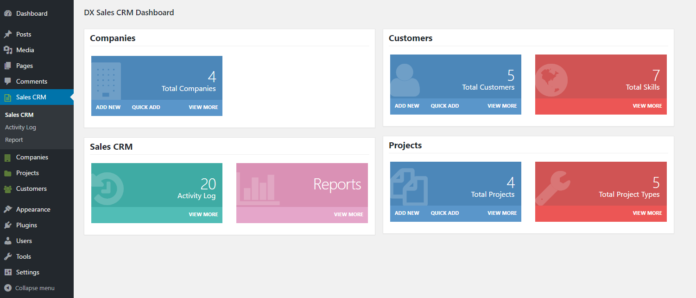
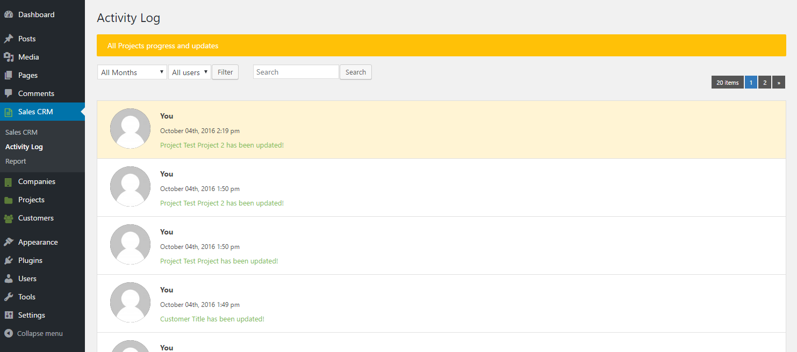
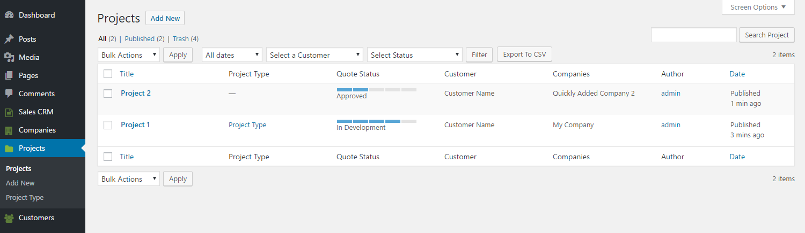
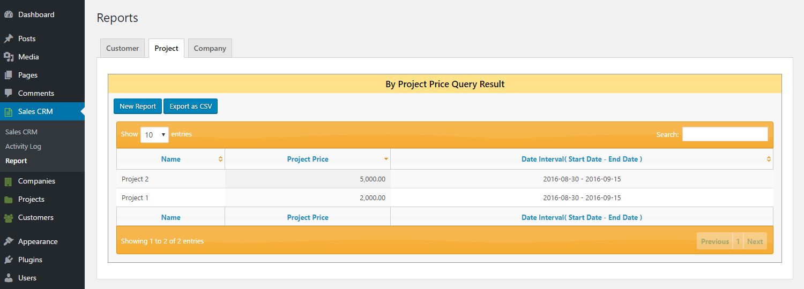

# 📊 DX Sales CRM – WordPress Plugin

**Author**: [Yogendra Dayal](https://github.com/yogendradayal)  
**Contributors**: yogendradayal

> A complete WordPress CRM solution to manage sales, customers, and business pipelines directly from your WordPress dashboard.

---

## 📋 Description

**DX Sales CRM** is a simple yet powerful plugin designed to help small businesses and sales teams manage their entire CRM operations inside WordPress.

With an intuitive interface and customizable features, it adapts to your sales workflow without the steep learning curve. No external SaaS needed—everything is managed locally.

---

## 🔧 Core Features

- 🧑‍💼 Manage customers, contacts, and sales leads  
- 📑 Create, view, and export detailed sales reports  
- 📈 Track sales pipelines with visual insights  
- 🖥️ Clean dashboard with recent activity log  
- 🔍 Advanced filtering and search options  
- 📤 CSV export for reports  
- 🔗 REST API support  
- 🧩 Built with custom post types, hooks & templates

---

## 🔐 Why Choose DX Sales CRM?

- ✅ 100% self-hosted — no third-party SaaS
- 📱 Fully mobile responsive
- 🧼 Clean, minimal UI inside WP admin
- 💡 Developer-friendly (hooks, REST API, templates)
- 🧠 Extendable for headless CMS & integrations

---

## 🚀 Installation

1. Download or clone this repository.
2. Upload the plugin folder to `/wp-content/plugins/` or install via the WP Dashboard.
3. Activate via the **Plugins** menu in WordPress.
4. Visit **Sales CRM** in the WP admin sidebar to get started.

---

## ❓ Frequently Asked Questions

**Q: What PHP and WP versions are required?**  
A: PHP 7.4+ and WordPress 5.9 or later.

**Q: Is this plugin mobile-friendly?**  
A: Yes, the dashboard and CRM views are responsive and optimized for mobile/tablets.

**Q: Will this plugin work with my theme?**  
A: Yes. It uses WordPress core admin UI — it's theme-agnostic.

**Q: Can I export sales data or reports?**  
A: Yes, you can download CSV reports for contacts, projects, and sales.

**Q: Is it developer-friendly?**  
A: Yes, with full support for actions, filters, and REST endpoints.

---

## 🖼️ Screenshots

> Make sure your images are located in the `assets/` folder or root of your repository.

### 1. Dashboard  

### 2. Activity Log  

### 3. Projects Section  

### 4. Reports Export  

---

## 📝 Changelog

### v1.1
- Added "Last Edited" timestamp support
- Improved UI and mobile responsiveness
- Tested with WordPress 6.7

### v1.0
- Initial release with customer, project, and report features

---

## ⚠️ Upgrade Notice

**Version 1.1** improves compatibility with the latest WordPress release and introduces new data tracking capabilities.

---

